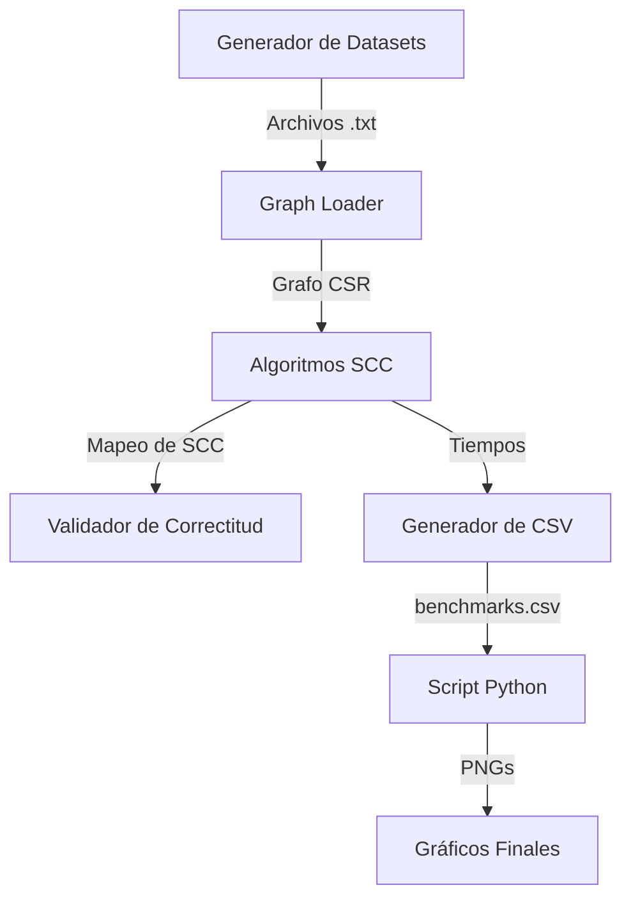

# Arquitectura del Sistema

El sistema sigue una arquitectura modular diseñada para la extensibilidad y el rendimiento:

## 1. Módulos de Código
- **Graph Engine (`src/graph`)**: Implementa la estructura CSR y los generadores sintéticos.
- **SCC Suite (`src/scc`)**: Contiene las implementaciones de Tarjan, BGSS y la lógica de VGC.
- **Data Structures (`src/scc/hashbag.hpp`)**: Implementaciones de estructuras concurrentes.
- **Benchmark Suite (`src/benchmark`)**: Lógica de medición de tiempo y persistencia de resultados.

## 2. Flujo de Datos

## 3. Tecnologías
- **C++17**: Para el núcleo de alto rendimiento.
- **OpenMP**: Para el paralelismo multinúcleo.
- **Pandas**: Para la manipulación de datos experimentales.
- **Matplotlib**: Para la visualización de resultados científicos.
